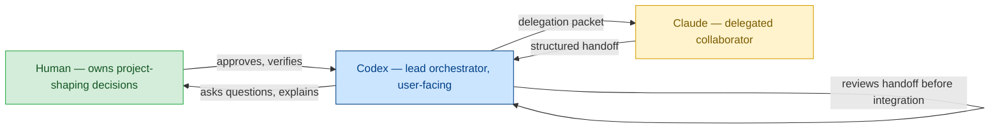
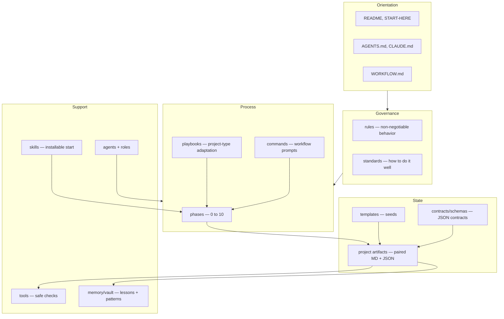
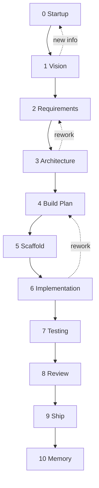
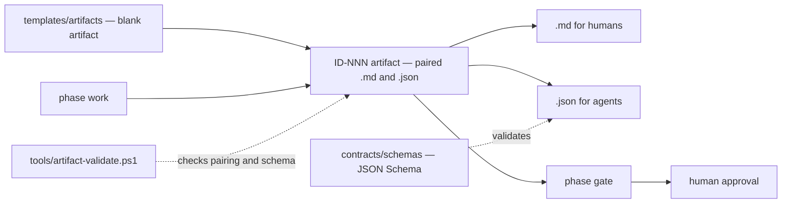

# Software Factory, Explained

This is the **complete map** of Software Factory — top to bottom, every component, how each part connects to the others, and why each one earns its place. If you want to understand the whole system at once, this is the file to read.

It complements the other entry points without repeating them:

- [README.md](README.md) — the pitch, setup, and design principles.
- [START-HERE.md](START-HERE.md) — what a human does first.
- [AGENTS.md](AGENTS.md) — the rules index agents must read before working.
- [WORKFLOW.md](WORKFLOW.md) — the phase *journey*, phase by phase.

This file is the **atlas**. The others are individual maps.

### How to read this

There are two layers. **Part A (the Guided Tour)** is a plain-language walkthrough of the whole system — read it start to finish the first time. **Parts B–D** are reference: visual maps, a component-by-component catalog, and a "why each piece exists" table you can jump into when you need a specific answer. You do not need to know how to code to read any of it.

---

## Part A — The Guided Tour

### 1. What Software Factory is

Software Factory is a **human-led, multi-agent framework for turning an idea into shipped software** — apps, games, tools, automations, websites, and more. An AI agent (Codex) leads the process: it asks questions, explains tradeoffs, does the technical work, and keeps the project moving through a clear sequence of phases. A second agent (Claude) can be delegated bounded work when useful, after Codex explains why; human approval is required when delegation affects approval-sensitive areas. **You, the human, stay in control of every decision that shapes the project.**

The framework runs on one core belief: *agents should make technical work easier without taking important decisions away from the human.* Everything else — the rules, the phases, the artifacts, the approval gates — exists to make that belief real.

A second design choice shapes the whole repo: **it is documents and templates first, automation later.** Software Factory v1 is mostly Markdown, JSON, and conversation, plus a few safe local scripts. There are no cloud services, databases, or always-on infrastructure required. The framework is meant to stay simple enough that a human can read and trust every part of it before any of it becomes automated.

### 2. The mental model: four moving parts

Almost everything in Software Factory is one of four things. Learn these four and the entire repository becomes predictable:

| Part | Question it answers | Where it lives |
| --- | --- | --- |
| **Roles** | *Who* is acting and with what judgment? | [roles/](roles/), [agents/](agents/) |
| **Phases** | *When* — what step of the journey are we in? | [phases/](phases/), [rules/phases.md](rules/phases.md) |
| **Artifacts** | *What was decided* — the memory of the project | [templates/](templates/), each project's `artifacts/` |
| **Gates** | *Who approved moving on* — the human checkpoint | [rules/human-approval.md](rules/human-approval.md) |

Everything else — rules, standards, playbooks, schemas, tools — exists to support these four. Rules govern behavior, standards govern quality, playbooks adapt the flow to a project type, schemas keep artifacts honest, and tools check the work. Hold the four-part model in your head and the rest slots into place.

### 3. The three actors



- **Human** — owns every project-shaping decision (scope, architecture, dependencies, spending, publishing) and approves each phase move. Always in control. See [rules/human-approval.md](rules/human-approval.md).
- **Codex** — the lead orchestrator and the agent you talk to. It interviews you, recommends best practices, explains tradeoffs, produces artifacts, coordinates tools, and recommends when Claude would help. See [agents/codex-lead.md](agents/codex-lead.md).
- **Claude** — a delegated collaborator for strenuous coding, second opinions, debugging, security/architecture review, and parallel verification. Claude works from a bounded **delegation packet** and returns a structured **handoff**; Codex reviews that handoff before anything is integrated. See [agents/claude-collaborator.md](agents/claude-collaborator.md) and [CLAUDE.md](CLAUDE.md).

Codex and Claude are *agent identities*. **Roles** (Architect, Builder, QA Reviewer, Security Reviewer, etc.) are *hats* either agent can wear — see [roles/README.md](roles/README.md).

### 4. The universal phase rhythm

Every phase — from startup to lessons-learned — repeats the **same seven-step loop**. Learn it once and you can predict what happens in any phase:

1. **Do the phase work** (interview, design, build, test…).
2. **Update project state** — `STATUS` and `PROJECT-CHECKLIST` (both Markdown and JSON).
3. **Create or revise the required artifacts** for that phase. Paired Markdown (for humans) and JSON (for agents) must stay aligned.
4. **Fix known errors** in the current phase, or have the human explicitly defer them.
5. **Summarize in plain language** what was done and what changed.
6. **Pass the phase gate** (a checklist of required conditions).
7. **Ask the human to approve** moving to the next phase.

The phase does not advance just because the work *feels* done. It advances only after the gate passes and the human approves. See [rules/phases.md](rules/phases.md) and [WORKFLOW.md](WORKFLOW.md).

### 5. End-to-end walkthrough

Here is the full journey for an imagined project — *"Clip Tidy," a small local tool that renames and sorts screenshot files* — with the artifact each phase produces. The artifact IDs (like `REQ-001`) are how the project remembers its own decisions.

| Phase | What happens | Artifact produced | Who must approve |
| --- | --- | --- | --- |
| **0 Startup** | Codex creates the project wrapper, captures first context, picks an **operating tier** | `STARTUP-001`, `OPERATING-001`, `STATUS`, `PROJECT-CHECKLIST` | Confirm and continue |
| **1 Vision** | Codex interviews you about what Clip Tidy is really for | `VISION-001` | Vision matches your intent |
| **2 Requirements** | Vision becomes concrete, testable requirements + explicit non-goals | `REQ-001` | Requirements are right |
| **3 Architecture** | Codex proposes a stack/runtime with tradeoffs (maybe just a small script) | `ARCH-001`, `ENV-001` | **Stack & dependencies** |
| **4 Build Plan** | Architecture becomes an ordered, verifiable plan | `PLAN-001` | Plan approved |
| **5 Scaffold** | Codex creates the project skeleton in `workspace/` | `SCAFFOLD-001` | Scaffold is the foundation |
| **6 Implementation** | The actual build; Codex may delegate bounded heavy coding to Claude when useful | `IMPL-001`, source, task records | New scope/deps |
| **7 Testing** | The build is exercised against Phase 2 requirements | `VERIFY-001`, `UAT-001` | Errors fixed or deferred |
| **8 Review** | Quality + security/privacy pass; Claude can provide a bounded second opinion | `REVIEW-001` | Review acceptable |
| **9 Ship** | Publish / push / package — a real decision | `SHIP-001` | **Publishing** |
| **10 Memory** | Lessons, reusable patterns, known problems recorded | `MEMORY-001`, vault notes | Worth keeping |

Notice the pattern: each phase leaves behind a durable artifact, the human approves before each forward move, and the genuinely consequential decisions (architecture, dependencies, publishing) get an explicit gate of their own.

---

## Part B — Visual Maps

### System component map

How the major directories relate. Read top to bottom: orientation feeds rules and standards, which govern the phases, which are adapted by playbooks, which produce artifacts from templates, which are governed by schemas and checked by tools — with memory as the long-term reference layer.



### Phase lifecycle and gates

Each forward arrow crosses a **gate** requiring explicit human approval. Agents may also move *backward* when new information invalidates an earlier assumption.



### Artifact data flow

How a single phase's decisions become trustworthy, persistent state:



### Annotated directory tree

```text
Software Factory/
├── README.md              Pitch, setup, principles, standards index
├── START-HERE.md          Human's first-read orientation
├── AGENTS.md              Canonical rules-reading order for agents
├── CLAUDE.md              Claude's entry point + delegation contract
├── WORKFLOW.md            The phase journey (narrative + agent table)
├── ROADMAP.md             What's done, the MVP direction, what's later
├── CHANGELOG.md           History of framework changes
├── factory.config.json    Framework-level settings + active project
├── .env / .env.example    Local non-secret settings (real .env is ignored)
│
├── rules/                 Non-negotiable agent behavior (12 files)
├── standards/             Proportional "how to do it well" guides (28 files)
├── phases/                One file per phase, 00 to 10 (11 files)
├── playbooks/             Project-type router + per-type adaptations (14 files)
├── roles/                 Reusable judgment "hats"
├── agents/               Codex + Claude identity docs
│
├── commands/              Codex workflow prompts + their contracts
├── contracts/schemas/     JSON Schemas that govern artifacts (20 schemas)
├── templates/             Blank artifact + project-wrapper seeds
│   ├── artifacts/         22 paired artifact templates
│   └── projects/          STATUS + PROJECT-CHECKLIST starters
│
├── tools/                 Safe, read-only local scripts + tool registry
│   ├── factory.ps1        Runner: doctor/status/validate/tasks/events
│   ├── artifact-validate.ps1  Markdown/JSON pairing + schema checks
│   ├── secret-scan.ps1    Credential scan before commits
│   └── registry.{md,json} Map of approved/known/deferred tools
├── skills/                Installable "start a new project" skill
├── .githooks/pre-commit   Optional tracked pre-commit hook
│
├── projects/              Generated projects (git-ignored by default)
│   └── <slug>/            STATUS, PROJECT-CHECKLIST, artifacts/, workspace/
├── memory/vault/          Lessons, patterns, history (git-ignored)
├── logs/events/           Ignored JSONL troubleshooting breadcrumbs
├── plans/                 Working notes, queues, findings
│
├── PROJECT-IDEAS.md       Human scratchpad: project ideas
├── FRAMEWORK-IDEAS.md     Human scratchpad: framework ideas
├── FIXES.md               Human scratchpad: things to fix
└── DEFERRED.md            Explicitly deferred work
```

---

## Part C — Component & Capability Reference

Each subsection answers the same four questions: **what it is, what's inside, how it connects, why it's useful.**

### Entry points & configuration

- [README.md](README.md) — the front door: what you get, how to set up, design principles, and the standards index.
- [START-HERE.md](START-HERE.md) — the human's how-to: what to tell Codex first, what files are safe to write in, idea intake, and the one important approval rule.
- [AGENTS.md](AGENTS.md) — the **required reading order** for any agent, plus the operating rules and the prime directive ("help the human create the *right* software, not merely more software").
- [CLAUDE.md](CLAUDE.md) — Claude's scoped entry point and the delegation/handoff contract.
- [WORKFLOW.md](WORKFLOW.md) — the end-to-end phase journey with a running example and a per-phase agent table.
- [ROADMAP.md](ROADMAP.md) — what's in v1, the confirmed **script-assisted, local-first MVP direction**, and what's intentionally deferred.
- [factory.config.json](factory.config.json) — framework-level settings: version, `active_project`, default explanation/model policy, default IDE, project root, memory vault path, and `automation_status` (currently `documented-not-implemented`).
- `.env` / [.env.example](.env.example) — local non-secret settings. The real `.env` is git-ignored; long-lived tokens never belong here.

**Why:** these give every reader (human or agent) a consistent starting point and a single source for framework-wide settings.

### `rules/` — non-negotiable behavior

Twelve files defining how agents *must* behave. Unlike standards (which scale with the project), rules are constant.

| Rule | Purpose |
| --- | --- |
| [core.md](rules/core.md) | Human control, agent-led/human-verified, honesty, leanness, locality-by-default |
| [human-approval.md](rules/human-approval.md) | The exact list of decisions that require human approval |
| [phases.md](rules/phases.md) | The phase sequence and what a gate requires |
| [agent-human-interaction.md](rules/agent-human-interaction.md) | The core question/recommend/explain loop |
| [coordination.md](rules/coordination.md) | How Codex and Claude divide work without ceremony |
| [error-handling.md](rules/error-handling.md) | State failures honestly; don't advance over unresolved errors |
| [project-structure.md](rules/project-structure.md) | Keep framework, artifacts, and generated source separate |
| [security-privacy.md](rules/security-privacy.md) | Security and privacy as first-class constraints |
| [memory.md](rules/memory.md) | Memory is a reference layer, not the runtime |
| [cost-control.md](rules/cost-control.md) | Warn before spending real money |
| [model-policy.md](rules/model-policy.md) | Capability tiers; model routing documented, not automated |
| [tool-use.md](rules/tool-use.md) | Use tools to reduce effort; adopt new tools deliberately |

**Why:** rules are the guardrails that keep agents from silently expanding scope, hiding uncertainty, or making project-shaping decisions on their own.

### `standards/` — how to do it well (proportionally)

Twenty-eight guides for *quality*, applied **in proportion to the project's purpose, risk, audience, and lifecycle**. Standards are advice with teeth, grouped by concern:

- **Quality & sizing:** [engineering-quality.md](standards/engineering-quality.md), [project-rigor-levels.md](standards/project-rigor-levels.md), [project-operating-tiers.md](standards/project-operating-tiers.md)
- **Build & stack:** [stack-profiles.md](standards/stack-profiles.md), [coding.md](standards/coding.md), [environment-runtime.md](standards/environment-runtime.md), [windows-local-development.md](standards/windows-local-development.md)
- **Safety & tooling:** [security.md](standards/security.md), [tool-adoption.md](standards/tool-adoption.md), [starter-toolbox.md](standards/starter-toolbox.md), [tauri-dependency-audit.md](standards/tauri-dependency-audit.md)
- **Process:** [human-actions.md](standards/human-actions.md), [new-project-startup.md](standards/new-project-startup.md), [idea-intake.md](standards/idea-intake.md), [audit-workflow.md](standards/audit-workflow.md), [project-audit.md](standards/project-audit.md), [cleanup-workflow.md](standards/cleanup-workflow.md), [artifact-validation.md](standards/artifact-validation.md), [file-based-task-records.md](standards/file-based-task-records.md), [local-logs-events.md](standards/local-logs-events.md)
- **Delivery & UX:** [testing.md](standards/testing.md), [user-acceptance-testing.md](standards/user-acceptance-testing.md), [accessibility.md](standards/accessibility.md), [ui-ux.md](standards/ui-ux.md), [documentation.md](standards/documentation.md), [platform-support.md](standards/platform-support.md), [git-github.md](standards/git-github.md), [framework-git-backup.md](standards/framework-git-backup.md)

**Why:** they let a tiny prototype stay lightweight while a public, money-handling app gets real discipline — without rewriting the framework for each project.

### Operating Tiers vs Rigor Levels — two independent dials

A concept worth isolating because it's easy to conflate. They are **two separate knobs**, both set during Startup:

| Dial | Measures | Set by | File |
| --- | --- | --- | --- |
| **Operating Tier** | How much *process and agent effort* to spend | How deep/fast the human wants to go | [project-operating-tiers.md](standards/project-operating-tiers.md) |
| **Rigor Level** | How much *testing/security/shipping discipline* the risk demands | Risk, audience, data sensitivity | [project-rigor-levels.md](standards/project-rigor-levels.md) |

The tiers run from **Tier 1 (Full Operating Model)** through **Tier 2 (Standard)**, **Tier 3 (Lean)**, to **Tier 4 (Fast MVP)**. Crucially, there is a **risk floor**: a fast Tier-4 project that touches sensitive data, payments, auth, or public deployment must *still* apply the relevant rigor and approvals. Effort can go down; required safety cannot.

**Why:** this prevents both over-engineering a throwaway script and under-engineering something that quietly handles real risk.

### `phases/` — the step-by-step process

Eleven files, [00-startup.md](phases/00-startup.md) through [10-memory-lessons.md](phases/10-memory-lessons.md), each specifying the work, the required artifacts, and the gate for that phase. They are the detailed instructions behind the lifecycle diagram in Part B.

**Why:** they make the journey concrete and repeatable, so any project moves through the same trustworthy sequence.

### `playbooks/` — adapting the flow to a project type

Fourteen files. The [project-type-router.md](playbooks/project-type-router.md) maps what you're building to a starting playbook ([app](playbooks/app.md), [website](playbooks/website.md), [game](playbooks/game.md), [desktop](playbooks/desktop.md), [cli-tool](playbooks/cli-tool.md), [automation](playbooks/automation.md), [ai-system](playbooks/ai-system.md), [data-dashboard](playbooks/data-dashboard.md), [browser-extension](playbooks/browser-extension.md), [library](playbooks/library.md), [software-factory-workflow](playbooks/software-factory-workflow.md), [generic](playbooks/generic.md)). Playbooks are **guidance, not rigid scripts** — they adapt the universal phases without replacing the gates, startup artifacts, architecture phase, or human-action files. See [playbooks/README.md](playbooks/README.md).

**Why:** a game and a CLI tool need different defaults; playbooks supply those without forking the whole framework.

### `roles/` & `agents/` — judgment vs identity

- [agents/](agents/) — the two agent *identities*: [codex-lead.md](agents/codex-lead.md) (orchestrator) and [claude-collaborator.md](agents/claude-collaborator.md) (delegated specialist).
- [roles/README.md](roles/README.md) — reusable *hats* either agent can wear: Architect, Builder, QA Reviewer, Security Reviewer, UX Reviewer, Documentation Writer, DevOps/Release, Memory Curator. A project records its primary and supporting roles in `OPERATING-001`.

**Why:** separating *who is acting* (identity) from *what judgment they're applying* (role) keeps reviews and recommendations honest — an agent can say "wearing my Security Reviewer hat, here's my concern."

### `commands/` — Codex workflow prompts

Today these are **plain-language phrases you say to Codex**, not registered slash commands. [commands/README.md](commands/README.md) lists them (`start a new project`, `run vision`, `run requirements`, `run architecture`, `run plan`, `run scaffold`, `run build`, `run test`, `run uat`, `run review`, `run ship`, `run memory`, `run gate`, `run project status`, `audit framework`, `audit project`, `triage ideas`, `route this idea`, `create Claude delegation`, `review Claude handoff`, `split work between Codex and Claude`, `wrap up`) alongside reserved `/slash` names for future automation. [commands/contracts.md](commands/contracts.md) defines the fail-closed behavior that future automation must follow; [commands/local-runner.md](commands/local-runner.md) and [commands/potential-future-commands.md](commands/potential-future-commands.md) cover the runner and future ideas.

**The rule that matters:** workflow prompts **never bypass approval gates**.

**Why:** they give the workflow a consistent vocabulary now, and a clear contract for when it gets automated later.

### `contracts/schemas/` — keeping agent state honest

Twenty JSON Schemas that define the *shape* of every machine-readable artifact, all building on [artifact-base.schema.json](contracts/schemas/artifact-base.schema.json) (every artifact has at least an `id` and `type`). They cover project status, checklists, phase gates, phase summaries, requirements, architecture, environment setup, build plans, scaffold notes, implementation notes, verification/review reports, shipping plans, memory packets, operating models, human actions, approvals, task records, and local events.

**Why:** schemas catch malformed or drifting JSON automatically, so the agent-readable state stays trustworthy for handoffs and future automation.

### `templates/` — seeds for new work

- [templates/artifacts/](templates/artifacts/) — 22 paired (`.md` + `.json`) blank artifacts: ACTION, APPROVAL, ARCH, AUDIT, DELEGATION, ENV, GATE, HANDOFF, IMPL, MEMORY, OPERATING, PLAN, REQ, REVIEW, SCAFFOLD, SHIP, STARTUP, SUMMARY, TASK, UAT, VERIFY, VISION.
- [templates/projects/](templates/projects/) — the project-wrapper starters: `STATUS`, `PROJECT-CHECKLIST` (Markdown + JSON).

**Why:** templates make every new project and artifact start consistent and schema-valid, instead of being hand-rolled each time.

### The artifacts model — the project's memory

Artifacts are how a project remembers its own decisions. Two rules define them:

- **Paired Markdown + JSON.** Markdown is mandatory for humans; JSON is the machine-readable source for agents. The pair must **never drift** — that's what `artifact-validate.ps1` enforces.
- **`ID-NNN-name` convention.** Every artifact has a typed ID (e.g. `VISION-001`, `GATE-005`, `ACTION-002`) so it can be referenced precisely.

In a project they live under `projects/<slug>/artifacts/` in folders by family (startup, vision, requirements, architecture, environment, plans, scaffold, implementation, testing, review, shipping, memory, phase-gates, phase-summaries, human-actions, tasks, handoffs, research).

**Why:** durable paired artifacts are what let a project be paused, resumed, audited, or handed between agents without losing the "why" behind past decisions.

### `tools/` — safe local checks

PowerShell scripts plus a tool registry. The hard boundary: **they never advance phases, approve gates, install tools, publish, push, or deploy.** Most runner commands are read-only views or checks; the bounded exception is local JSONL event logging for troubleshooting breadcrumbs.

- [tools/factory.ps1](tools/factory.ps1) — the local runner: `doctor`, `status`, `validate`, `tasks`, `events`.
- [tools/artifact-validate.ps1](tools/artifact-validate.ps1) — checks Markdown/JSON pairing, schema conformance, and lightweight semantic drift.
- [tools/secret-scan.ps1](tools/secret-scan.ps1) — scans for credentials before commits/publishing.
- [tools/registry.md](tools/registry.md) / [tools/registry.json](tools/registry.json) — the map of tools by status (`core`, `preferred`, `approved`, `optional`, `deferred`, `restricted`, `rejected-for-now`), including preferred stack profiles. A map, **not** automatic permission to use anything.
- [.githooks/pre-commit](.githooks/pre-commit) — optional tracked hook (enable with `git config core.hooksPath .githooks`).

**Why:** they protect the workflow from drift and leaked secrets while staying safe enough to run anytime, because they can't change project direction.

### `skills/` — the installable starting point

[skills/sf-start/SKILL.md](skills/sf-start/SKILL.md) is an installable skill (`software-factory-start-project`) that front-loads the "start a new project" flow: it reads the required files, runs the project-type router, then continues normal Phase 0 Startup and records the routing in `STARTUP-001`/`OPERATING-001`.

**Why:** it turns the most common entry action into a one-step, consistent on-ramp.

### `projects/` — where real work lives

Each generated project is a self-contained wrapper:

```text
projects/<slug>/
├── STATUS.md / status.json                 current state
├── PROJECT-CHECKLIST.md / project-checklist.json   phase progress
├── artifacts/                              all phase artifacts (paired)
└── workspace/                              the actual generated source code
```

`projects/` is **git-ignored by default** so each generated app stays a separate, GitHub-ready project rather than getting tangled into the framework repo. This local checkout may contain ignored example projects as living references — such as `recipe-keeper` (a shipped Tauri desktop app), `portfolio`, `simple-zombie-game` (Godot), and small proof projects (`phase0-proof-grocery-list`, `scaffold-memory-proof`, `dependency-scaffold-proof`, `toolbox-smoke-test`) — but those are local reference material, not guaranteed contents of a published framework checkout.

**Why:** strict separation keeps the framework reusable and every project independently shippable; local examples, when present, show the artifacts in real use.

### `memory/vault/` — the long-term reference layer

A numbered knowledge base ([memory/vault/INDEX.md](memory/vault/INDEX.md)) holding what's worth carrying between projects: `00-session-summaries`, `01-user-preferences`, `02-framework-decisions`, `03-project-history`, `04-known-problems`, `05-reusable-patterns`, `06-reference`, with conventions/templates under `_meta`. It is **git-ignored** because it can hold private history, and it is a **reference layer, not the runtime** — artifacts remain authoritative.

**Why:** it lets each new project start smarter (known pitfalls, proven patterns, user preferences) without those notes leaking into the public framework or becoming load-bearing.

### Human-in-the-loop machinery

The features that keep the human genuinely in control:

- **Human-action files** ([standards/human-actions.md](standards/human-actions.md), [artifacts/human-actions/](artifacts/human-actions/)) — durable `ACTION-NNN` instructions whenever you must do something outside the conversation (install a tool, add a key, run a command). The agent never *assumes* such work is done.
- **Approval gates** — the explicit human checkpoint between every phase and before every project-shaping decision.
- **Idea intake** ([standards/idea-intake.md](standards/idea-intake.md)) — `triage ideas` / `route this idea` classify rough notes without turning them into approved scope.
- **Audits** ([standards/audit-workflow.md](standards/audit-workflow.md)) — `audit framework` / `audit project` inspect health and *report*; they never silently change direction.
- **Scratchpads** — safe places for human notes: [PROJECT-IDEAS.md](PROJECT-IDEAS.md), [FRAMEWORK-IDEAS.md](FRAMEWORK-IDEAS.md), [FIXES.md](FIXES.md), and [DEFERRED.md](DEFERRED.md) for explicitly parked work.

**Why:** these turn "the human is in control" from a slogan into specific, enforced mechanisms.

### Tracking & history

- [CHANGELOG.md](CHANGELOG.md) — what changed in the framework over time.
- [ROADMAP.md](ROADMAP.md) — v1 scope, the MVP direction, recently completed work, and what's deferred to later.
- [plans/](plans/) — working notes, the rolling operating queue, and findings from proof runs.
- [logs/events/](logs/events/) — ignored JSONL breadcrumbs for troubleshooting (never authoritative over artifacts).

**Why:** they preserve the framework's own decision history and current direction, separate from any single project.

---

## Part D — Why each piece exists

The whole system is a set of answers to "what could go wrong when an AI builds software for a human?" Each component prevents a specific failure:

| Component | The problem it prevents |
| --- | --- |
| **Approval gates** | The agent silently changing scope, architecture, or direction |
| **Phases** | Jumping to code before the idea, requirements, and plan are clear |
| **Paired MD + JSON artifacts** | Losing the "why" behind decisions; humans and agents reading different truths |
| **Contracts / schemas** | Malformed or drifting machine-readable state breaking handoffs |
| **`artifact-validate.ps1`** | Markdown and JSON quietly disagreeing |
| **Rules** | Agents hiding uncertainty, over-reaching, or skipping the human |
| **Standards** | One-size-fits-all quality — too heavy for a script, too light for a real app |
| **Operating tiers** | Over-engineering throwaways / under-engineering serious work |
| **Rigor levels + risk floor** | Speed quietly cutting required safety on risky projects |
| **Playbooks + router** | Forcing every project type through identical defaults |
| **Roles** | Vague reviews with no stated point of view |
| **Tool adoption + registry** | Tool sprawl and creeping, unvetted dependencies |
| **Human-action files** | Assuming external/manual setup already happened |
| **Secret scan + hook** | Committing or publishing credentials |
| **Memory vault** | Starting every project from zero, repeating known mistakes |
| **Project/framework separation** | Generated apps tangling into the framework repo |
| **Idea intake + scratchpads** | Rough notes silently becoming committed scope |
| **Audits** | Drifting, stale, or contradictory project state going unnoticed |
| **Delegation packet + handoff** | Claude expanding scope or work landing without Codex review |

Read together, these are the same idea expressed many times: **make it easy for an agent to do excellent technical work, and impossible for it to take the important decisions away from the human.** That is Software Factory.
