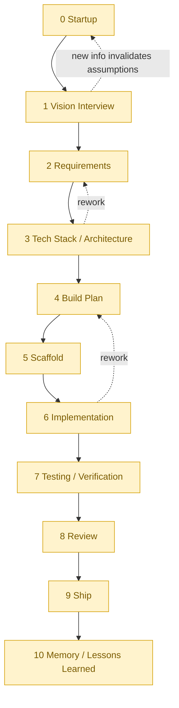

# Software Factory Workflow

This is the end-to-end picture of how a project moves through Software Factory, from a rough idea to a shipped result and recorded lessons. It complements two other entry points:

- [START-HERE.md](START-HERE.md) - orientation for a human picking up the framework.
- [AGENTS.md](AGENTS.md) - the canonical rules index that agents must read before doing framework work.

This file shows the journey in motion. It does not restate the rules; it links to them.

## How to read this

There are two layers below. The **walkthrough** is a plain-language narrative for a human seeing the process for the first time. The **agent reference** near the end is a dense, per-phase table for Codex and Claude to follow at runtime. Read the layer that fits you; both describe the same loop.

Three roles run throughout:

- **Human** - owns every project-shaping decision and approves each phase move. Always in control.
- **Codex** - the lead orchestrator and primary user-facing agent. Asks questions, explains tradeoffs, keeps the project moving, and coordinates tools and collaborators.
- **Claude** - a delegated collaborator for strenuous coding, second opinions, debugging, security or architecture review, and parallel verification. Works from a delegation packet and returns a structured handoff. See [CLAUDE.md](CLAUDE.md).

## The loop at a glance



Each arrow forward crosses a **phase gate** that requires an explicit human approval. Agents may also move *backward* when new information invalidates an earlier assumption - when that happens they explain why and update the affected artifacts. See [rules/phases.md](rules/phases.md).

## The universal phase rhythm

Every phase - startup through lessons learned - repeats the same rhythm. Learn it once and the whole framework becomes predictable:

1. **Do the phase work** (interview, design, build, test, etc.).
2. **Update project state** - `PROJECT-CHECKLIST.md` and `project-checklist.json`, plus `STATUS.md` and `status.json`.
3. **Create or revise the required artifacts** for that phase. Paired Markdown and JSON must stay aligned - Markdown for humans, JSON for agents.
4. **Fix known errors** in the current phase, or have the human explicitly defer them.
5. **Summarize in plain language** what was done and what changed.
6. **Pass the phase gate** (checklist below).
7. **Ask the human to approve** moving to the next phase.

The phase does not change just because the work feels finished. It changes only after the gate passes and the human approves. See [rules/phases.md](rules/phases.md) and [rules/human-approval.md](rules/human-approval.md).

## Walkthrough: phases 0-10

The narrative below follows one running example - *"Clip Tidy," a small local tool that renames and sorts screenshot files* - to make each phase concrete.

### 0 - Startup

Codex captures the first useful context and creates the project wrapper at `projects/clip-tidy/`. It seeds `STATUS.md`, `status.json`, `PROJECT-CHECKLIST.md`, `project-checklist.json`, and `STARTUP-001-new-project-startup.*` from templates. **Human** describes the idea and confirms the name. Startup doesn't need full project-shaping approval, but Codex still summarizes and asks whether to continue. See [phases/00-startup.md](phases/00-startup.md).

### 1 - Vision Interview

Codex interviews the human about what *Clip Tidy* is really for, who uses it, and what "done" looks like. The output is a written vision the human recognizes as their own. **Human** decides scope and success criteria. Trigger phrase: `run vision`.

### 2 - Requirements

The vision becomes concrete, testable requirements - what the tool must do, constraints (local-only, no cloud), and explicit non-goals. **Human** confirms the requirements match their intent before any technical commitment.

### 3 - Tech Stack / Architecture

Codex proposes a stack, runtime, dependency, and environment strategy with tradeoffs, and recommends one. For *Clip Tidy* that might be a small PowerShell or Python script - no framework needed. Choosing a stack, adding major dependencies, or using cloud resources are **project-shaping decisions that need human approval**. Codex may delegate an architecture or security review to **Claude**. Trigger phrase: `run architecture`. See [standards/stack-profiles.md](standards/stack-profiles.md).

### 4 - Build Plan

The architecture becomes an ordered, reviewable build plan: what gets built, in what order, and how each piece is verified. **Human** approves the plan before scaffolding. This is where work can be split into tasks for parallel or delegated execution.

### 5 - Scaffold

Codex creates the initial project skeleton inside `projects/clip-tidy/workspace/`. Source code stays out of `workspace/` until scaffolding is approved. **Human** approves the scaffold as the foundation to build on.

### 6 - Implementation

The actual build. Codex often delegates strenuous coding to **Claude** with a clear delegation packet; Claude returns a structured handoff describing what changed, what was verified, and what's uncertain. Artifacts and the checklist stay current as work lands. **Human** stays informed and approves any new scope or dependency that emerges.

### 7 - Testing / Verification

The build is exercised against the Phase 2 requirements. Codex (or Claude, in parallel) runs and documents tests and surfaces failures honestly. Unresolved errors **block** advancement unless the human explicitly defers them. See [standards/testing.md](standards/testing.md) and [standards/user-acceptance-testing.md](standards/user-acceptance-testing.md).

### 8 - Review

A quality and security pass before shipping: correctness, engineering quality proportional to risk, and security/privacy surfaces. Codex commonly delegates this review to **Claude** for a second opinion. A project audit is recommended here, especially before shipping or after repeated failures. See [phases/08-review.md](phases/08-review.md) and [standards/project-audit.md](standards/project-audit.md).

### 9 - Ship

Publishing, deployment, GitHub repo creation, or pushing - each is a **decision that requires explicit human approval**. A secret scan runs before publishing when credentials were used. **Human** gives the final go. See [standards/git-github.md](standards/git-github.md). Trigger phrase: `run gate` to confirm readiness first.

### 10 - Memory / Lessons Learned

After shipping, Codex records lessons learned, reusable patterns, and known problems into the memory vault so the next project starts smarter. **Human** confirms what's worth keeping. Trigger phrases: `run memory`, then `wrap up` for a session summary.

## Approval gates and when humans must step in

A phase gate must pass before any forward move. Required checks (from [rules/phases.md](rules/phases.md)):

- `PROJECT-CHECKLIST.md` and `project-checklist.json` reflect the current phase state.
- Required artifacts for the phase exist, and paired Markdown/JSON are aligned.
- Known errors in the current phase are fixed, or explicitly deferred by the human.
- Required human actions are completed or intentionally deferred.
- Open questions affecting scope, architecture, privacy, security, cost, runtime, or shipping are answered.
- The agent has summarized the work and stated the next recommendation.
- The human has approved moving to the next phase.

Beyond phase moves, the human must approve (from [rules/human-approval.md](rules/human-approval.md)): major scope or architecture changes, adding major dependencies or paid services, using cloud resources, deployment/publishing, GitHub repo creation or push, auth or payment systems, databases or external APIs with meaningful risk, handling sensitive data, destructive filesystem or repo actions, and license decisions that matter.

When the human must do something outside normal conversation - install a tool, add a key, run a command - the agent creates a **human-action file** rather than assuming it's done. See [standards/human-actions.md](standards/human-actions.md).

## Agent reference

One row per phase. `Command` is the Codex workflow prompt (see [commands/README.md](commands/README.md)); these are conversation phrases today and may become native commands later.

| Phase | Primary actor | Key artifacts produced | Gate focus | Command |
| --- | --- | --- | --- | --- |
| 0 Startup | Codex | `STATUS.*`, `PROJECT-CHECKLIST.*`, `STARTUP-001-*` | Wrapper created; context clear enough to continue | `start a new project` |
| 1 Vision Interview | Codex + Human | Vision artifact | Vision reflects human intent | `run vision` |
| 2 Requirements | Codex | Requirements (`REQ-*`) | Requirements testable; non-goals explicit | - |
| 3 Architecture | Codex (Claude review) | `ARCH-*`, `ENV-*` | Stack/deps/runtime approved | `run architecture` |
| 4 Build Plan | Codex | `PLAN-*` | Ordered, verifiable plan approved | - |
| 5 Scaffold | Codex | `SCAFFOLD-*`, `workspace/` skeleton | Scaffold approved as foundation | - |
| 6 Implementation | Codex + Claude | `IMPL-*`, source, task records | Scope honored; artifacts current | - |
| 7 Testing | Codex / Claude | `VERIFY-*` | No unresolved errors (or deferred) | - |
| 8 Review | Claude (delegated) | `REVIEW-*` | Quality + security/privacy checked | - |
| 9 Ship | Codex + Human | `SHIP-*` | Publish/push approved; secret scan clean | `run gate` |
| 10 Memory | Codex | `MEMORY-*`, vault notes | Lessons recorded | `run memory`, `wrap up` |

Delegation contract: Codex hands Claude a clear delegation packet; Claude completes the scoped task, avoids scope expansion, and returns a structured handoff (what changed, what was verified, what's uncertain). See [rules/coordination.md](rules/coordination.md) and [standards/file-based-task-records.md](standards/file-based-task-records.md).

## Commands and local checks

Codex workflow prompts (used in conversation): `start a new project`, `run vision`, `run architecture`, `run gate`, `run project status`, `run memory`, `wrap up`. See [commands/README.md](commands/README.md).

Optional repo-local runner for safe, read-only checks - it does not install tools, create projects, advance phases, approve gates, publish, push, or deploy:

```powershell
powershell.exe -NoProfile -ExecutionPolicy Bypass -File tools/factory.ps1 doctor
powershell.exe -NoProfile -ExecutionPolicy Bypass -File tools/factory.ps1 status
powershell.exe -NoProfile -ExecutionPolicy Bypass -File tools/factory.ps1 validate
powershell.exe -NoProfile -ExecutionPolicy Bypass -File tools/factory.ps1 tasks
```

Before committing framework changes, run the secret scan and artifact validation (see [README.md](README.md#local-validation)):

```powershell
powershell.exe -NoProfile -ExecutionPolicy Bypass -File tools/secret-scan.ps1 -All
powershell.exe -NoProfile -ExecutionPolicy Bypass -File tools/artifact-validate.ps1 -All
```

## Where things live

- `projects/<slug>/` - the project wrapper: `STATUS.*`, `PROJECT-CHECKLIST.*`, phase artifacts, and `workspace/` for generated code. Ignored by the framework repo so each project stays a separate, GitHub-ready project.
- `memory/vault/` - session summaries, lessons, reusable patterns, known problems. Ignored because it can hold private history.
- Framework files - `rules/`, `phases/`, `standards/`, `commands/`, `contracts/`, `templates/`, `tools/` - the reusable framework itself.

Project work and private memory stay out of the framework repo by default. To publish an example or a sanitized note, copy it into a dedicated public location instead of committing the live local folder. See [rules/project-structure.md](rules/project-structure.md).

